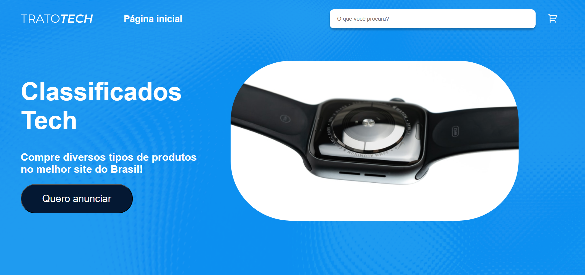

# Trato Tech

E-commerce de produtos tech com carrinho de compras, navegação por categorias e busca — construído com React, Redux Toolkit e Immer.

🔗 [Ver projeto ao vivo](https://trato-tech-immer-main.vercel.app)

---

## 📸 Preview



---

## 🛠️ Tecnologias

- React 18
- Redux Toolkit
- Immer
- React Router v6
- SCSS Modules
- React Hook Form

---

## 💡 Destaques técnicos

- Gerenciamento de estado global com Redux Toolkit
- Mutação de estado com Immer — diferença entre mutar o rascunho diretamente e retornar novo valor
- Correção de bug real: reducer `mudarQuantidade` reatribuía `state` em vez de mutar via Immer

---

## 🚀 Como rodar

```bash
npm install
npm start
```

Acesse [http://localhost:3000](http://localhost:3000) no navegador.

---

## 👨‍💻 Autor

**Renan Fochetto** — [LinkedIn](https://linkedin.com/in/renanfochetto) · [Portfolio](https://renanfochetto.dev)

---

> Design e escopo baseados no curso de Redux da Alura.